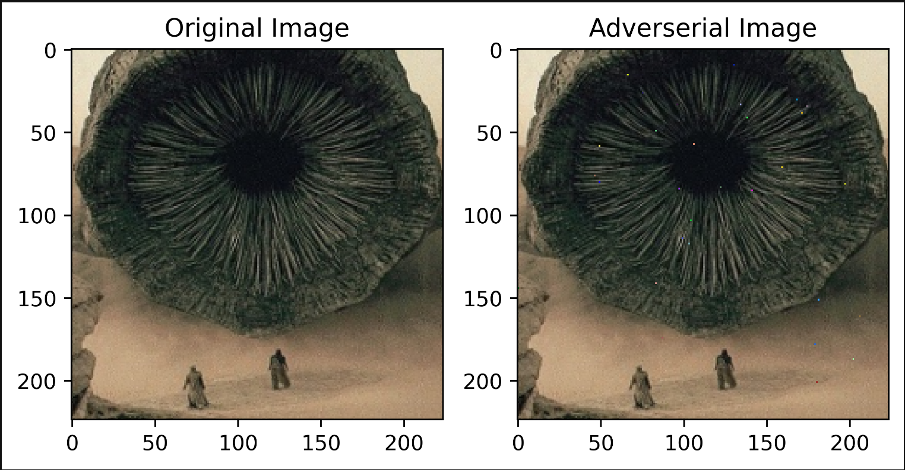
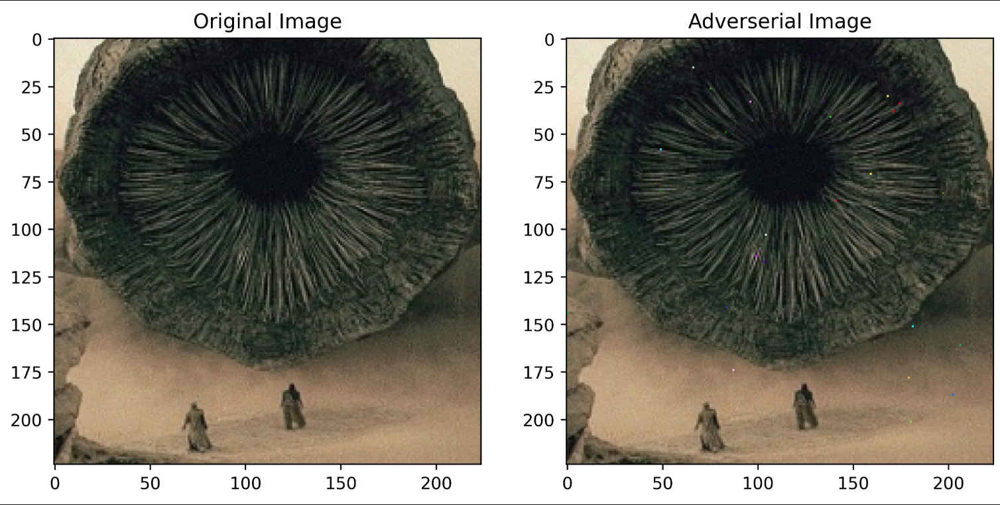

* Description : the fremen are trying to sabotage the spice harvest and they need your help! spice harvesters have worm image recognition technology to know when to avoid a worm attack. luckily for you, a hacker genius got access to the pixels of the worm image, but you can only change up to 30 pixels of it. can you help the fremen destroy a spice harvester?  

* Challenge Files : [model.pt](https://github.com/Parth-Badgujar/Parth-Badgujar.github.io/raw/main/content/ctf-writeups/UMDCTF%202024%20/model.pt)   [server.py](https://raw.githubusercontent.com/Parth-Badgujar/Parth-Badgujar.github.io/main/content/ctf-writeups/UMDCTF%202024%20/server.py)   [worm.png](https://raw.githubusercontent.com/Parth-Badgujar/Parth-Badgujar.github.io/main/content/ctf-writeups/UMDCTF%202024%20/worm.png)  

## TLDR  

We were given a `worm.png` image and we had to perform an `L0 bound` adverserial attack, where we were not allowed to change values of more than 30 pixels such that the probability of the new image being a worm is < 0.5

## First Attack 

I used `torchattack` framework, which uses `One Pixel Attack` to generate the adverserial image 


One Pixel : It uses genetic algorithm to search for (x, y, r, g, b) tuples which reduce the given score (probability of class 1 in our case) 
 

```python
import torch
import torchvision
import torchattacks
import numpy as np
from PIL import Image
import torch.nn as nn
from tqdm.auto import tqdm
import matplotlib.pyplot as plt
import torch.nn.functional as F
from torchvision.models import resnet18

model = resnet18()
model.fc = nn.Linear(model.fc.in_features, 1)
model.load_state_dict(torch.load('model.pt'))
model.requires_grad_(False)

image = (torchvision.io.read_image("worm.png") / 255).unsqueeze(0)

#Multi Class Model
class TwoClass(nn.Module):
    def __init__(self):
        super(TwoClass, self).__init__()
        self.resnet = model
    def forward(self, x):
        x = self.resnet(x)
        probabilities = F.sigmoid(x)
        probabilities_multiclass = torch.cat((probabilities, 1 - probabilities), dim=1)
        return probabilities_multiclass
        
twoclass = TwoClass()


#One Pixel Attack
attack = torchattacks.OnePixel(twoclass, steps = 2000, popsize = 400,  pixels = 30)
adv = attack(image, torch.LongTensor([[1.]]))

with torch.inference_mode() : print(twoclass(adv))

#tensor([[0.5758, 0.4242]])
```

From the above attack I was able to get the probability between 0.56 and 0.58 

   

## Next Step 
To furthur decrease the classification probability, I performed an L1 bound adverserial attack on those 30 pixels which were changed using the `OnePixel` attack. 

```python

#Retreiving indecies of those 30 pixels
adverserial = (adv.detach() * 255).to(torch.uint8)
original = (image * 255).to(torch.uint8)
idx = []
for i in range(224):
    for j in range(224):
        if not torch.allclose(adverserial[:, :, i, j], original[: , :, i, j]):
            idx.append([i, j])
idx = torch.tensor(idx)
adverserial = adverserial / 255
original = original / 255


#Set requires_grad for 30 pixels
patch = adverserial[:, :, idx[:, 0], idx[:,1]].clone()
patch.requires_grad_(True)
optimizer = torch.optim.Adam([patch], lr = 0.5)


#Adverserial Attack
log_step = 40
num_iters = 400
for i in tqdm(range(num_iters)):
    new_image = adverserial.clone()
    new_image[:, :, idx[:, 0], idx[:,1]] = patch
    res = twoclass(new_image)
    if res[0][0] < 0.5 :
        print("Done")
        print()
        print(f"Final probability : {res[0][0].item():3f}")
        break 
    loss = F.cross_entropy(res, torch.LongTensor([1]))
    optimizer.zero_grad()
    loss.backward()
    optimizer.step()
    patch.data = torch.clamp(patch.data, 0 ,1) #L1 bound
    if (i+1) % log_step == 0 :
        print(f"Iter [{i+1}/{num_iters}] Probability : {res[0][0].item():3f}")
```

Within 100 iters you should be able to get the probability less than 0.5 



### Code to get the string of (x, y, r, g, b)
```python
result = ''
for i in range(30):
    x, y = idx[i]
    result += str(y.item())+','+str(x.item())+','+str(final_image[x.item()][y.item()][0]) + ',' + str(final_image[x.item()][y.item()][1]) + ',' + str(final_image[x.item()][y.item()][2]) + ';'
result = result[:-1]
```  

## Complete Attack 

```python
import torch
import torchvision
import torchattacks
import numpy as np
from PIL import Image
import torch.nn as nn
from tqdm.auto import tqdm
import torch.nn.functional as F
import matplotlib.pyplot as plt
from torchvision.models import resnet18
import matplotlib as mpl
mpl.rcParams['figure.dpi'] = 500

import warnings
warnings.filterwarnings("ignore")

model = resnet18()
model.fc = nn.Linear(model.fc.in_features, 1)
model.load_state_dict(torch.load('model.pt'))
model.requires_grad_(False)


image = (torchvision.io.read_image("worm.png") / 255).unsqueeze(0)


class TwoClass(nn.Module):
    def __init__(self):
        super(TwoClass, self).__init__()
        self.resnet = model
    def forward(self, x):
        x = self.resnet(x)
        probabilities = F.sigmoid(x)
        probabilities_multiclass = torch.cat((probabilities, 1 - probabilities), dim=1)
        return probabilities_multiclass
        
twoclass = TwoClass()

#One Pixel Attack
attack = torchattacks.OnePixel(twoclass, steps = 2000, popsize = 400,  pixels = 30)
adv = attack(image, torch.LongTensor([[1.]]))

with torch.inference_mode() : print(twoclass(adv))

##Adverserial Attack on 30 pixels  

#Extracting 30 (x, y) indexes 
adverserial = (adv.detach() * 255).to(torch.uint8)
original = (image * 255).to(torch.uint8)
idx = []
for i in range(224):
    for j in range(224):
        if not torch.allclose(adverserial[:, :, i, j], original[: , :, i, j]):
            idx.append([i, j])
idx = torch.tensor(idx)
adverserial = adverserial / 255
original = original / 255


#Set requires_grad of those 30 pixels
patch = adverserial[:, :, idx[:, 0], idx[:,1]].clone()
patch.requires_grad_(True)
optimizer = torch.optim.Adam([patch], lr = 0.5)

#Attacking those 30 pixels
log_step = 40
num_iters = 400
for i in tqdm(range(num_iters)):
    new_image = adverserial.clone()
    new_image[:, :, idx[:, 0], idx[:,1]] = patch
    res = twoclass(new_image)
    if res[0][0] < 0.5 :
        print("Done")
        print()
        print(f"Final probability : {res[0][0].item():3f}")
        break 
    loss = F.cross_entropy(res, torch.LongTensor([1]))
    optimizer.zero_grad()
    loss.backward()
    optimizer.step()
    patch.data = torch.clamp(patch.data, 0 ,1)
    if (i+1) % log_step == 0 :
        print(f"Iter [{i+1}/{num_iters}] Probability : {res[0][0].item():3f}")

#Creating final (x, y, r, g, b) string
result = ''
for i in range(30):
    x, y = idx[i]
    result += str(y.item())+','+str(x.item())+','+str(final_image[x.item()][y.item()][0]) + ',' + str(final_image[x.item()][y.item()][1]) + ',' + str(final_image[x.item()][y.item()][2]) + ';'
result = result[:-1]


#Script to send the string to remote server
from pwn import * 
import base64
p = remote("challs.umdctf.io", 31774)

# PoW solver
p.recvuntil("work:\n")
command = p.recvline().decode().strip()
poW = os.popen(command).read().strip()
p.sendlineafter("solution:", poW)


p.sendlineafter("...':", result)

data = p.recvall(timeout = 5)
print(data.decode())
p.close()


